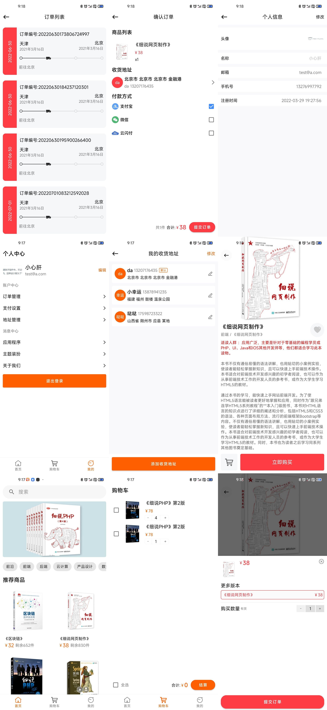

# 快乐淘

## 介绍

主要界面有: 登录、注册、主界面、搜索页面、商品界面、购物车、提交订单、查询订单、个人中心

API是使用: https://www.showdoc.com.cn/1207745568269674/6094279351627422

## UI

## 特点

* 使用 Retrofit2 + 协程 + Flow 完成网络请求
* 内置主题换肤
* 使用RegisterForActivityResult进行动态权限申请

## 联系我

* QQ：2928527233
* CSDN：https://blog.csdn.net/weixin_51298509
